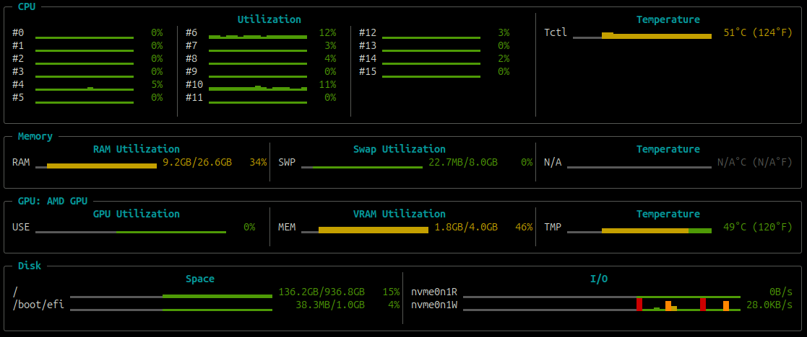

# ttop

A minimal, full-screen terminal system monitor for Linux, written in Rust.

> **Disclaimer:** This is a fun, vibe-coded side project — not intended for real-world or production use. Use it at your own risk and discretion. No guarantees of correctness, stability, or fitness for any purpose are provided. [Read more here.](TERMS.md)



## What is ttop?

ttop is a lightweight alternative to `top` and `htop` focused on displaying real-time hardware utilization with scrolling sparkline charts. It provides a 1-minute rolling history of system metrics at a glance.

## Monitored Metrics

| Metric | Detail |
|--------|--------|
| **CPU** | Per-core utilization and per-core temperature readings (all logical processors) |
| **Memory** | RAM and swap usage, DIMM temperature |
| **GPU** | Utilization, memory, and temperature |
| **Disk** | Per-filesystem space usage, per-device read/write I/O throughput |

## Design Principles

- **Minimal dependencies** — reads directly from Linux kernel interfaces (`/proc/`, `/sys/`) instead of wrapping external libraries.
- **Two external crates** — `crossterm` for terminal control and `libc` for `statvfs` (disk space queries; already a transitive dependency of crossterm).
- **Readable at a glance** — color-coded sparkline charts make it easy to spot load patterns and danger zones without reading numbers.
- **Full-screen** — uses the alternate screen buffer like htop, restoring the terminal cleanly on exit.

## Target Platform

- Ubuntu 25.10 (Linux kernel 6.x+)
- Any terminal emulator with 256-color support

## Usage

```
ttop
```

Press `q` or `Ctrl+C` to exit.

## Development

### Host Setup (Ubuntu 25.10)

Install system dependencies:

```bash
sudo apt-get update
sudo apt-get install -y build-essential curl
```

Install the Rust toolchain via [rustup](https://rustup.rs/):

```bash
curl --proto '=https' --tlsv1.2 -sSf https://sh.rustup.rs | sh
source "$HOME/.cargo/env"
```

Build and run:

```bash
cargo build
cargo run
```

Run with optimizations (release build):

```bash
cargo build --release
./target/release/ttop
```

#### Linting

[Clippy](https://github.com/rust-lang/rust-clippy) is Rust's official static analysis tool. It catches common mistakes, unidiomatic patterns, and performance issues. The codebase must stay warning-free.

```bash
cargo clippy
cargo clippy --tests  # also lint test code
```

#### Tests

All tests live as integration tests in the `tests/` directory, mirroring the `src/` module structure. Run all tests with:

```bash
cargo test
```

To add tests, create or extend a `.rs` file under `tests/` that mirrors the source module being tested (e.g., `tests/disk/space.rs` for `src/disk/space.rs`).

#### Commit Messages

This project follows the [Conventional Commits](https://www.conventionalcommits.org/en/v1.0.0/) specification. A Cursor skill at [`.cursor/skills/conventional-commit/SKILL.md`](.cursor/skills/conventional-commit/SKILL.md) can generate compliant commit messages from your staged changes.

#### Before Committing

Always run the following before pushing changes:

```bash
cargo clippy --tests
cargo test
```

Both must pass with zero warnings and zero failures.

### Docker Setup

The project includes a Dockerfile based on Ubuntu 25.10 with Rust and all build dependencies pre-installed. The container idles by default (`tail -f /dev/null`) so you can attach to it and work interactively.

Build and start the container:

```bash
docker compose up -d --build
```

Attach to the running container:

```bash
docker compose exec ttop bash
```

Once inside the container, build and run as usual:

```bash
cargo build
cargo run
```

Run tests inside the container:

```bash
cargo test
```

Stop and remove the container:

```bash
docker compose down
```

The `docker-compose.yml` mounts the project directory into the container and uses named volumes for the Cargo registry and build cache, so incremental builds are fast and your source edits on the host are reflected immediately inside the container.
